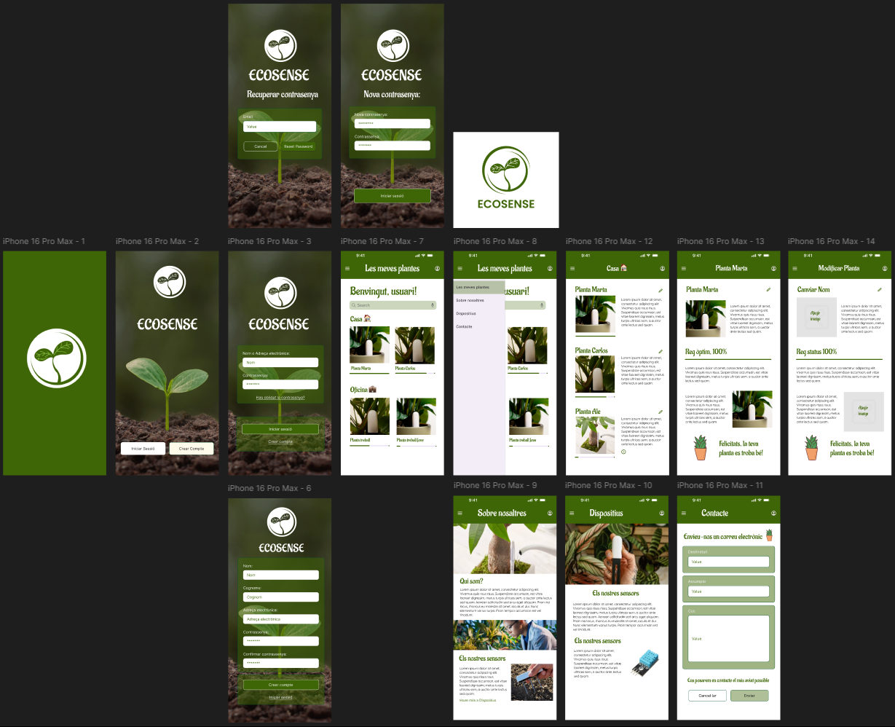
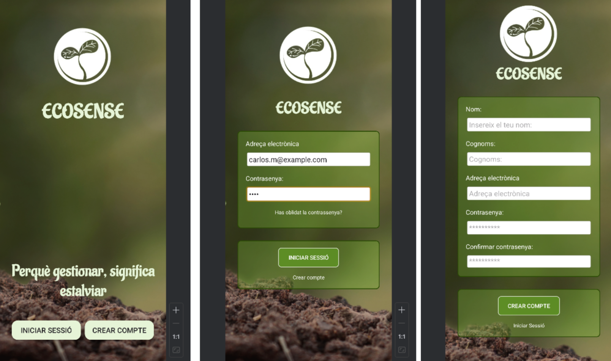
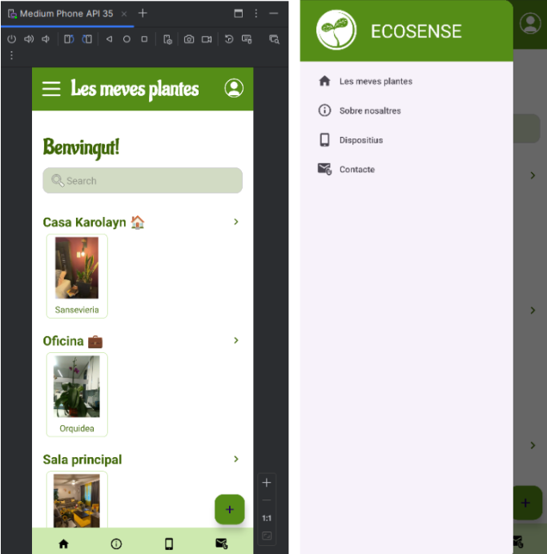
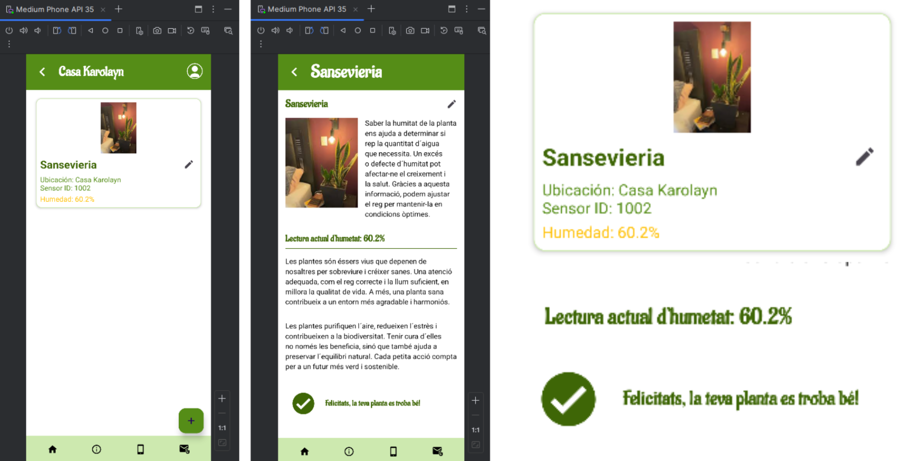
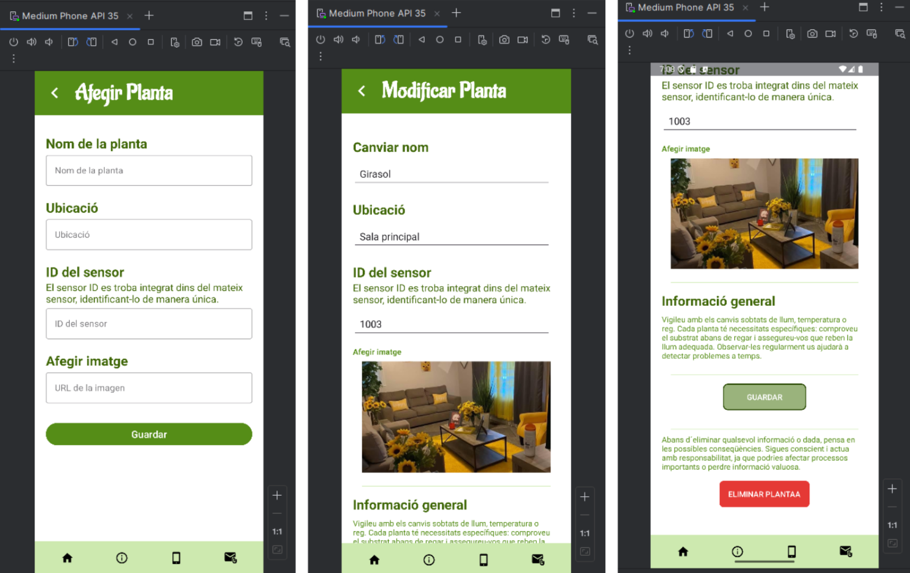
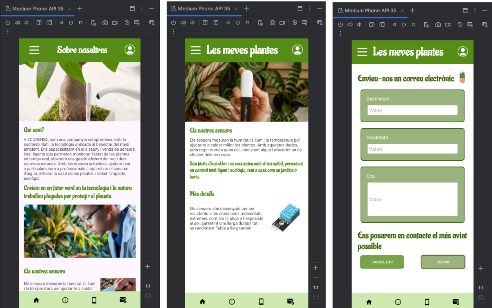

# Ecosense: Gestió i control d'humetat de les plantes
## Aplicació mòbil Ecosense
## Fet per Karolayn Muñoz

## Explicació clau
ECOSENSE és una aplicació desenvolupada per gestionar el control i manteniment de plantes en diferents entorns (domèstics, hivernacles o edificis, etc). Aquesta eina permet monitorar en temps real les condicions de les plantes (humitat) mitjançant sensors connectats, oferint:

- Registre automàtic: Dades contínues dels sensors emmagatzemades en una base de dades centralitzada.
- Supervisió senzilla: Interfície de l'app intuïtiva  per visualitzar l'estat de les plantes i rebre alertes (avisa si necessita reg).
- Gestió eficient: Funcions per afegir, modificar o eliminar plantes.

### Wireframe de l'aplicació

### Funcionament de l'aplicació
Per desenvolupar aquesta aplicació es va tenir en compte uns requeriments bàsics per a la funcionalitat de la aplicació Ecosense. Els quals són que l’usuari ougi accedir i consultar a la seva informació, les seves plantes etc. També, a més de les consultes, tenir la possibilitat d’afegir, modificar o eliminar qualsevol planta que el vulgui a la seva app.

L’aplicació està dissenyada perquè l’usuari pugui accedir-hi iniciant sessió. un cop l’usuari ore l’aplicació, se li demana que inici sessió amb un correu electrònic i una contrasenya. Si no té compte, també tindran l’opció de crear-ne una nova.

En el cas de que no sàpiga quina contrasenya té, també té l’opció de canviar-la i crear una nova.

Una vegada que l’usuari ha iniciat sessió, el portarà directament a la Pantalla Home, que és la de inici, té la mateixa funcionalitat que una safata d’entrada. En aquesta et mostra totes les plantes que té l’usuari agrupades per zones. En aquesta pantalla també e spot observar el menu fragment abaix del tot i el menu de costat que es el desplegable. 

Una vegada que s’ha visualitzat la pantalla principal, existeix un altre per veure la zona en específic i les seves plantes, la diferència es troba que a Pantalla Home es veuen totes les que té l’usuari, però a ZonaDetail només es veuen les plantes que es troben en la zona en específico. Després a cada planta es pot veure la seva informació per saber l’humitat, quan es fa clic sobre qualsevol planta es mostra el valor i el seu estat.

Després, es fa afegir un CRUD per a totes les plates, és a dir, es pot afegir, modificar i eliminar les plantes que l’usuari vulgi. Això s’aconsegueix mitjançant els endpoints de l’API que es van mencionar abans.

Per últim, com a pantalles informatives, es van realitzar tres, una per informació sobre la nostra empresa e idea de projecte, altre per informar sobre els sensor que utilizem i una ultima per contactar-se amb nosaltres en qualsevol situació.

